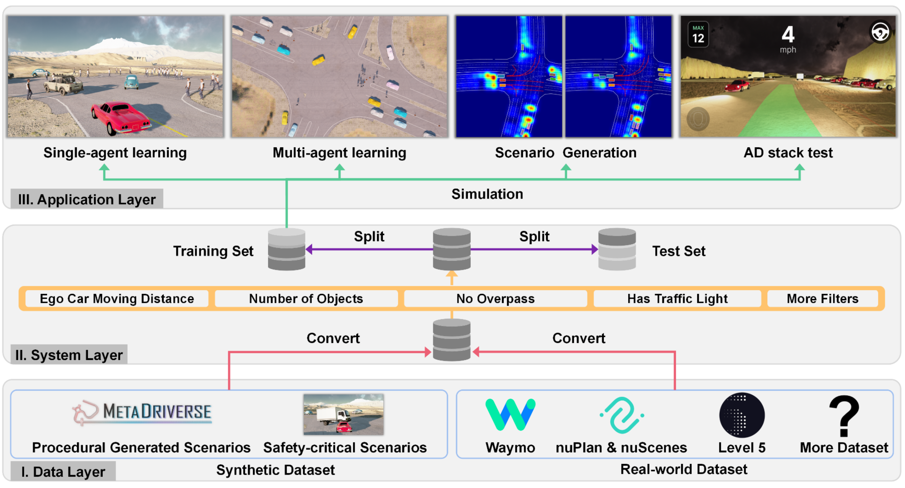

# ScenarioNet

**Open-Source Platform for Large-Scale Traffic Scenario Simulation and Modeling**

[
[**Webpage**](https://metadriverse.github.io/scenarionet/) |
[**Code**](https://github.com/metadriverse/scenarionet) |
[**Video**](https://youtu.be/3bOqswXP6OA) |
[**Paper**](http://arxiv.org/abs/2306.12241) |
[**Documentation**](https://scenarionet.readthedocs.io/en/latest/)
]

ScenarioNet allows users to load scenarios from real-world dataset like Waymo, nuPlan, nuScenes, l5 and synthetic
dataset such as procedural generated ones and safety-critical ones generated by adversarial attack.
The built database provides tools for building training and test sets for ML applications.

Powered by [MetaDrive Simulator](https://github.com/metadriverse/metadrive), the scenarios can be reconstructed for
various applications like AD stack test, reinforcement learning, imitation learning, scenario generation and so on.



## Installation

The detailed installation guidance is available
at [documentation](https://scenarionet.readthedocs.io/en/latest/install.html).
A simplest way to do this is as follows.

```
# create environment
conda create -n scenarionet python=3.9
conda activate scenarionet

# Install MetaDrive Simulator
git clone git@github.com:metadriverse/metadrive.git
cd metadrive
pip install -e.

# Install ScenarioNet
git clone git@github.com:metadriverse/scenarionet.git
cd scenarionet
pip install -e .
```

## API reference

All operations and API reference is available at
our [documentation](https://scenarionet.readthedocs.io/en/latest/operations.html).
If you already have ScenarioNet installed, you can check all operations by `python -m scenarionet.list`.

## Citation

If you used this project in your research, please cite

```latex
@article{li2023scenarionet,
    title={ScenarioNet: Open-Source Platform for Large-Scale Traffic Scenario Simulation and Modeling},
    author={Li, Quanyi and Peng, Zhenghao and Feng, Lan and Duan, Chenda and Mo, Wenjie and Zhou, Bolei and others},
    journal={arXiv preprint arXiv:2306.12241},
    year={2023}
    }
```
