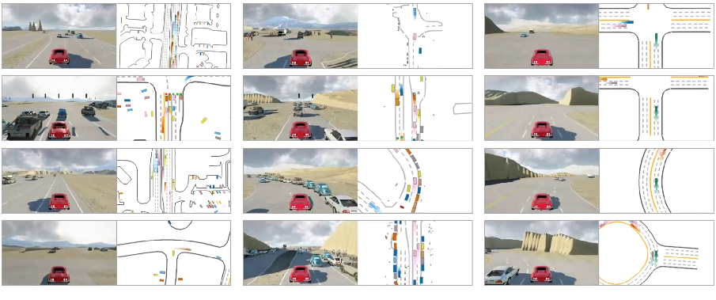

# ScenarioNet

**Open-Source Platform for Large-Scale Traffic Scenario Simulation and Modeling**

[**Webpage**](https://metadriverse.github.io/scenarionet/) |
[**Code**](https://github.com/metadriverse/scenarionet) |
[**Video**](https://youtu.be/3bOqswXP6OA) |
[**Paper**](http://arxiv.org/abs/2306.12241) |

ScenarioNet allows users to load scenarios from real-world dataset like Waymo, nuPlan, nuScenes, l5 and synthetic 
dataset such as procedural generated ones and safety-critical ones generated by adversarial attack.
The built database provides tools for building training and test sets for ML applications.  



Powered by [MetaDrive Simulator](https://github.com/metadriverse/metadrive), the scenarios can be reconstructed for
various applications like AD stack test, reinforcement learning, imitation learning, scenario generation and so on.


## Installation

```
# create environment
conda create -n scenarionet python=3.9
conda activate scenarionet

# Install MetaDrive Simulator
git clone git@github.com:metadriverse/metadrive.git
cd metadrive
pip install -e.

# Install ScenarioNet
git clone git@github.com:metadriverse/scenarionet.git
cd scenarionet
pip install -e .
```

## Usage

We provide some explanation and demo for all scripts here.
**You are encouraged to try them on your own, add ```-h``` or ```--help``` argument to know more details about these
scripts.**

### Convert

**Waymo**: the following script can convert Waymo tfrecord (version: v1.2, data_bin: training_20s) to Metadrive scenario 
description and store them at directory ./waymo

```
python -m scenarionet.convert_waymo -d waymo --raw_data_path /path/to/tfrecords --num_workers=16
```

**nuPlan**: the following script will convert nuPlan split containing .db files to Metadrive scenario description and
store them at directory ./nuplan

```
python -m scenarionet.convert_nuplan -d nuplan -raw_data_path /path/to/.db files --num_workers=16
```

**nuScenes**: as nuScenes split can be read by specifying version like v1.0-mini and v1.0-training, the following script
will convert all scenarios in that split

```
python -m scenarionet.convert_nuscenes -d nuscenes --version v1.0-mini --num_workers=16
```

**PG**: the following script can generate 10000 scenarios stored at directory ./pg

```
python -m scenarionet.scripts.convert_pg -d pg --num_workers=16 --num_scenarios=10000
```

### Merge & move

For merging two or more database, use

```
python -m scenarionet.merge_database -d /destination/path --from /database1 /2 ... 
```

As a database contains a path mapping, one should move database folder with the following script instead of ```cp```
command.
Using ```--copy_raw_data``` will copy the raw scenario file into target directory and cancel the virtual mapping.

```
python -m scenarionet.copy_database --to /destination/path --from /source/path
```

### Verify

The following scripts will check whether all scenarios exist or can be loaded into simulator.
The missing or broken scenarios will be recorded and stored into the error file. Otherwise, no error file will be
generated.
With teh error file, one can build a new database excluding or including the broken or missing scenarios.

**Existence check**

```
python -m scenarionet.check_existence -d /database/to/check --error_file_path /error/file/path
```

**Runnable check**

```
python -m scenarionet.check_simulation -d /database/to/check --error_file_path /error/file/path
```

**Generating new database**

```
python -m scenarionet.generate_from_error_file -d /new/database/path --file /error/file/path
```

### visualization

Visualizing the simulated scenario

```
python -m scenarionet.run_simulation -d /path/to/database --render --scenario_index
```

