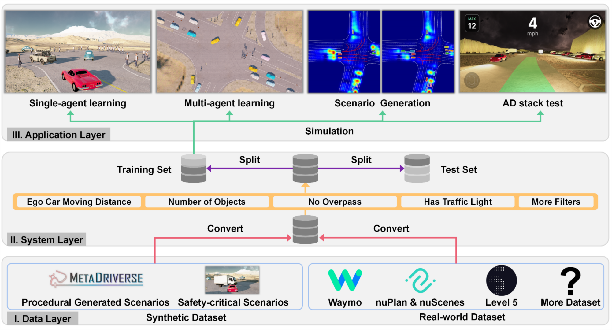

# ScenarioNet

[](https://scenarionet.readthedocs.io/en/latest/?badge=latest)
[](http://github.com/metadriverse/scenarionet/actions)
[](https://github.com/metadriverse/scenarionet/blob/main/LICENSE.txt)

**Open-Source Platform for Large-Scale Traffic Scenario Simulation and Modeling**

[
[**Webpage**](https://metadriverse.github.io/scenarionet/) |
[**Code**](https://github.com/metadriverse/scenarionet) |
[**Video**](https://youtu.be/3bOqswXP6OA) |
[**Paper**](http://arxiv.org/abs/2306.12241) |
[**Documentation**](https://scenarionet.readthedocs.io/en/latest/)
]


***Colab example for running simulation with ScenarioNet:***
[](https://colab.research.google.com/github/metadriverse/scenarionet/blob/main/tutorial/simulation.ipynb)


***Colab example for reading established ScenarioNet dataset:***
[](https://colab.research.google.com/github/metadriverse/scenarionet/blob/main/tutorial/read_established_scenarionet_dataset.ipynb)


ScenarioNet allows users to load scenarios from real-world datasets like Waymo, nuPlan, 
nuScenes, l5 and synthetic dataset such as procedural generated ones and safety-critical 
ones generated by adversarial attack. The built database provides tools for building 
training and test sets for ML applications.

Powered by [MetaDrive Simulator](https://github.com/metadriverse/metadrive), 
the scenarios can be reconstructed for various applications like AD stack test, 
reinforcement learning, imitation learning, scenario generation and so on.



## Installation

The detailed installation guidance is available
at [documentation](https://scenarionet.readthedocs.io/en/latest/install.html).
A simplest way to do this is as follows.

```
# create environment
conda create -n scenarionet python=3.9
conda activate scenarionet

# Install MetaDrive Simulator
cd ~/  # Go to the folder you want to host these two repos.
git clone https://github.com/metadriverse/metadrive.git
cd metadrive
pip install -e.

# Install ScenarioNet
cd ~/  # Go to the folder you want to host these two repos.
git clone https://github.com/metadriverse/scenarionet.git
cd scenarionet
pip install -e .
```

## API reference

All operations and API reference is available at
our [documentation](https://scenarionet.readthedocs.io/en/latest/operations.html).
If you already have ScenarioNet installed, you can check all operations by `python -m scenarionet.list`.

## ScenarioNet dataset and Scenario Description

Please refer to the [Scenario Description section](https://metadrive-simulator.readthedocs.io/en/latest/scenario_description.html
) in MetaDrive documentation for a walk-through.

## Citation

If you used this project in your research, please cite:

```latex
@article{li2023scenarionet,
  title={ScenarioNet: Open-Source Platform for Large-Scale Traffic Scenario Simulation and Modeling},
  author={Li, Quanyi and Peng, Zhenghao and Feng, Lan and Liu, Zhizheng and Duan, Chenda and Mo, Wenjie and Zhou, Bolei},
  journal={Advances in Neural Information Processing Systems},
  year={2023}
}
```
